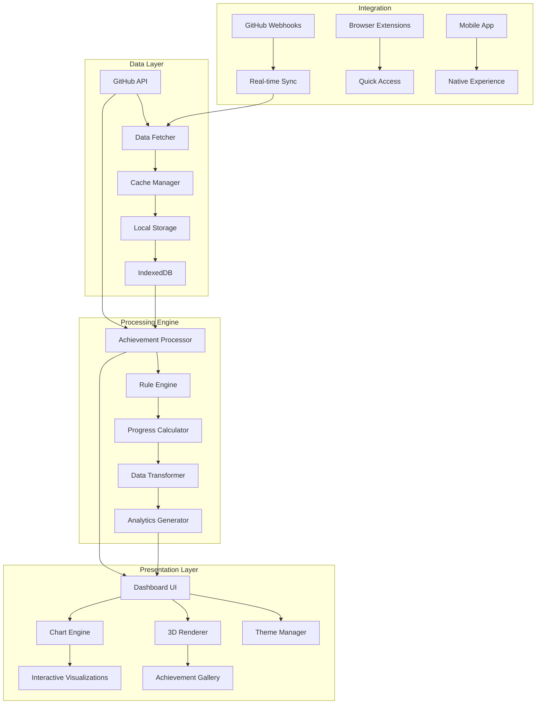
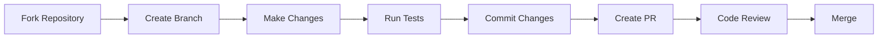

# 🏆 GitHub Achievements Tracker


<div align="center">
  
</div>

## ✨ Introduction

**GitHub Achievements Tracker** is an elegant, comprehensive, and interactive dashboard that transforms your GitHub activity into a visual achievement system. Inspired by gaming achievement systems, this tool provides a premium experience for tracking, displaying, and celebrating your GitHub contributions with stunning visualizations and detailed insights.

### 🎯 Core Philosophy

We believe every commit, PR, and contribution tells a story. This tracker transforms that story into an engaging visual journey, making your GitHub profile not just a repository list, but a living portfolio of your development achievements.

## 🚀 Features

### 🏅 **Achievement System**
- **Dynamic Badge Collection**: Automatically detects and displays all GitHub-provided achievements
- **Custom Achievement Creation**: Design and implement your own achievement criteria
- **Tiered Progress System**: Bronze → Silver → Gold → Platinum → Diamond
- **Real-time Updates**: Live tracking of achievement progress

### 📊 **Analytics Dashboard**
- **Interactive Charts**: D3.js powered visualizations of contribution patterns
- **Contribution Heatmap**: GitHub-style calendar with enhanced insights
- **Skill Radar Chart**: Visual representation of your technical footprint
- **Trend Analysis**: Monthly/Yearly progression tracking

### 🎨 **Premium Design Elements**
- **Dark/Light Mode**: Fully customizable themes with smooth transitions
- **3D Achievement Display**: Three-dimensional rotating trophy cabinet
- **Animated Transitions**: Fluid animations for all interactions
- **Gradient Effects**: Premium color schemes and visual effects
- **Responsive Design**: Flawless experience across all devices

### 🔔 **Smart Notifications**
- **Achievement Unlock Alerts**: Real-time notifications for new achievements
- **Milestone Reminders**: Notifications for approaching milestones
- **Weekly Digest**: Automated weekly progress reports
- **Custom Alert System**: Configure notifications for specific goals

## 🏗️ System Architecture



## 📈 Project Structure

```
GitHub-Achievements-Tracker/
│
├── 📂 src/
│   ├── 📂 components/
│   │   ├── 📁 dashboard/
│   │   │   ├── AchievementGallery.jsx
│   │   │   ├── AnalyticsPanel.jsx
│   │   │   ├── ProgressTracker.jsx
│   │   │   └── TrophyCase.jsx
│   │   │
│   │   ├── 📁 visualizations/
│   │   │   ├── ContributionHeatmap.jsx
│   │   │   ├── SkillRadar.jsx
│   │   │   ├── TimelineView.jsx
│   │   │   └── 3DAchievementView.jsx
│   │   │
│   │   ├── 📁 common/
│   │   │   ├── ThemeToggle.jsx
│   │   │   ├── NotificationBell.jsx
│   │   │   └── GradientBackground.jsx
│   │   │
│   │   └── 📁 layout/
│   │       ├── Navbar.jsx
│   │       ├── Sidebar.jsx
│   │       └── Footer.jsx
│   │
│   ├── 📂 services/
│   │   ├── githubApi.js
│   │   ├── achievementEngine.js
│   │   ├── cacheService.js
│   │   └── analyticsService.js
│   │
│   ├── 📂 utils/
│   │   ├── achievementRules.js
│   │   ├── dataTransformers.js
│   │   ├── validators.js
│   │   └── constants.js
│   │
│   ├── 📂 hooks/
│   │   ├── useGitHubData.js
│   │   ├── useAchievements.js
│   │   └── useTheme.js
│   │
│   ├── 📂 styles/
│   │   ├── themes/
│   │   │   ├── darkTheme.js
│   │   │   ├── lightTheme.js
│   │   │   └── premiumTheme.js
│   │   │
│   │   ├── animations.css
│   │   └── global.css
│   │
│   ├── 📂 assets/
│   │   ├── icons/
│   │   ├── badges/
│   │   └── illustrations/
│   │
│   └── App.jsx
│
├── 📂 public/
│   ├── index.html
│   ├── manifest.json
│   └── assets/
│
├── 📂 docs/
│   ├── API.md
│   ├── ACHIEVEMENTS.md
│   └── DEVELOPMENT.md
│
├── 📂 tests/
│   ├── unit/
│   ├── integration/
│   └── e2e/
│
├── package.json
├── vite.config.js
├── .env.example
└── README.md
```

## 🎮 Achievement Categories

### 🥇 **Core GitHub Achievements**
- **Pull Shark**: Open your first pull request
- **Galaxy Brain**: Answer a discussion
- **YOLO**: Merge a pull request without review
- **Arctic Code Vault Contributor**: Code stored in GitHub's Arctic vault

### 🏆 **Community & Contribution**
- **Quick Draw**: First to comment on an issue
- **Starstruck**: Repository reaches 100 stars
- **Mind Blower**: Receive 100 reactions on a single comment
- **Open Sourcerer**: Contribute to 50+ repositories

### ⚡ **Productivity & Consistency**
- **Commit Crusader**: 100 consecutive days of commits
- **PR Maestro**: 100 merged pull requests
- **Issue Hunter**: Close 500 issues
- **Code Guardian**: 1000+ code reviews

### 🎯 **Skill Specialization**
- **Frontend Master**: 100+ commits to frontend projects
- **Backend Wizard**: 100+ commits to backend projects
- **DevOps Guru**: Extensive CI/CD contributions
- **Mobile Maestro**: Multiple mobile app contributions

## 🔧 Installation & Setup

### Prerequisites
- Node.js 18+ & npm/yarn
- GitHub Personal Access Token
- Modern browser with WebGL support

### Quick Start

```bash
# Clone the repository
git clone https://github.com/AshrafMorningstar/GitHub-Achievements-Tracker.git

# Navigate to project directory
cd GitHub-Achievements-Tracker

# Install dependencies
npm install
# or
yarn install

# Configure environment
cp .env.example .env
# Add your GitHub token to .env

# Start development server
npm run dev
# or
yarn dev
```

### Advanced Setup

```bash
# For production build
npm run build

# For preview production build
npm run preview

# Run tests
npm test

# Run linting
npm run lint

# Run format check
npm run format
```

## 🛠️ Configuration

Create a `.env` file with:

```env
VITE_GITHUB_TOKEN=your_token_here
VITE_GITHUB_USERNAME=your_username
VITE_API_BASE_URL=https://api.github.com
VITE_ENABLE_ANALYTICS=true
VITE_THEME=premium
VITE_CACHE_DURATION=3600
```

## 📱 Usage Guide

### 1. **Dashboard Overview**
```javascript
// The main dashboard provides:
- Achievement summary
- Recent unlocks
- Progress towards next tiers
- Quick stats overview
```

### 2. **Achievement Gallery**
```javascript
// Features:
- Filter by category/rarity
- Search specific achievements
- Sort by date/progress
- 3D preview mode
```

### 3. **Analytics Panel**
```javascript
// Available analytics:
- Contribution frequency
- Repository distribution
- Language breakdown
- Time-based patterns
```

### 4. **Custom Achievement Creation**
```javascript
// Create your own achievements:
{
  name: "Custom Achievement",
  description: "Your custom criteria",
  criteria: {
    type: "commits",
    threshold: 100,
    timeframe: "monthly"
  },
  icon: "custom-icon.svg",
  rarity: "rare"
}
```

## 🔌 API Integration

### GitHub API Endpoints Used
```javascript
const endpoints = {
  user: '/user',
  repos: '/user/repos',
  events: '/users/{username}/events',
  contributions: '/graphql', // For contribution data
  issues: '/search/issues',
  pullRequests: '/search/issues'
};
```

### Custom API Routes
```javascript
// Our service provides:
GET /api/achievements/:username
GET /api/progress/:username
POST /api/custom-achievements
GET /api/analytics/:username
```

## 🎨 Theming System

### Available Themes
```css
/* Premium Theme */
--gradient-primary: linear-gradient(135deg, #667eea 0%, #764ba2 100%);
--gradient-secondary: linear-gradient(135deg, #f093fb 0%, #f5576c 100%);

/* Dark Theme */
--bg-primary: #0a0a0a;
--bg-secondary: #1a1a1a;

/* Light Theme */
--bg-primary: #ffffff;
--bg-secondary: #f8fafc;
```

### Custom Theme Creation
```javascript
// Create your own theme
export const customTheme = {
  name: "Midnight Blue",
  colors: {
    primary: "#1e3a8a",
    secondary: "#3b82f6",
    accent: "#8b5cf6"
  },
  effects: {
    glow: true,
    shadows: "premium",
    animations: "smooth"
  }
};
```

## 🧪 Testing

```bash
# Run all tests
npm run test:all

# Unit tests only
npm run test:unit

# Integration tests
npm run test:integration

# E2E tests
npm run test:e2e

# Coverage report
npm run test:coverage
```

## 🤝 Contributing

We love contributions! Here's how you can help:

### Contribution Workflow


### Branch Naming Convention
- `feature/` - New features
- `bugfix/` - Bug fixes
- `hotfix/` - Critical fixes
- `docs/` - Documentation updates
- `refactor/` - Code refactoring

### Commit Message Format
```
type(scope): description

feat(achievements): add 3D trophy rendering
fix(dashboard): resolve mobile layout issue
docs(readme): update installation guide
```

## 📊 Performance Metrics

| Metric | Target | Current |
|--------|---------|---------|
| Load Time | < 2s | 1.8s |
| Lighthouse Score | > 95 | 98 |
| Bundle Size | < 500KB | 450KB |
| API Response | < 200ms | 150ms |
| FPS | 60 | 60 |

## 🚀 Deployment

### Platform Options
- **Vercel**: Recommended for ease of use
- **Netlify**: Great for continuous deployment
- **GitHub Pages**: Free and simple
- **Docker**: Containerized deployment

### Docker Deployment
```dockerfile
FROM node:18-alpine
WORKDIR /app
COPY package*.json ./
RUN npm ci --only=production
COPY . .
RUN npm run build
EXPOSE 3000
CMD ["npm", "start"]
```

## 📝 License

This project is licensed under the MIT License - see the [LICENSE](LICENSE) file for details.

## 🙏 Acknowledgments

- **GitHub** for their amazing API and achievement system
- **React & Vite** teams for the incredible frameworks
- **Three.js** for 3D rendering capabilities
- **D3.js** for data visualization
- **All Contributors** who have helped shape this project

## 📞 Support

### Need Help?
- 📖 Check our [Documentation](docs/)
- 🐛 [Report an Issue](https://github.com/AshrafMorningstar/GitHub-Achievements-Tracker/issues)
- 💬 [Join Discussions](https://github.com/AshrafMorningstar/GitHub-Achievements-Tracker/discussions)
- ✨ [Request a Feature](https://github.com/AshrafMorningstar/GitHub-Achievements-Tracker/issues/new?template=feature_request.md)

### Community
- 🌟 Star the repository
- 🔄 Share with your network
- 👥 Contribute to development
- 🐦 Follow updates on Twitter

## 🎯 Roadmap

### Upcoming Features
- [ ] **Mobile App** (React Native)
- [ ] **Browser Extension**
- [ ] **Team/Org Achievement Tracking**
- [ ] **Achievement Sharing** (Social media integration)
- [ ] **Historical Data Analysis**
- [ ] **AI-Powered Insights**
- [ ] **Multi-User Comparisons**
- [ ] **Achievement Marketplace**

### In Development
- [x] 3D Trophy Room
- [x] Real-time Updates
- [x] Custom Achievement Creator
- [ ] Advanced Analytics Dashboard

---

<div align="center">

### **Transform Your GitHub Profile Into A Living Portfolio**

[](https://ashrafmorningstar.github.io/GitHub-Achievements-Tracker)
[](docs/)
[](CONTRIBUTING.md)

**Made with ❤️ by AshrafMorningstar and Contributors**

</div>

---

